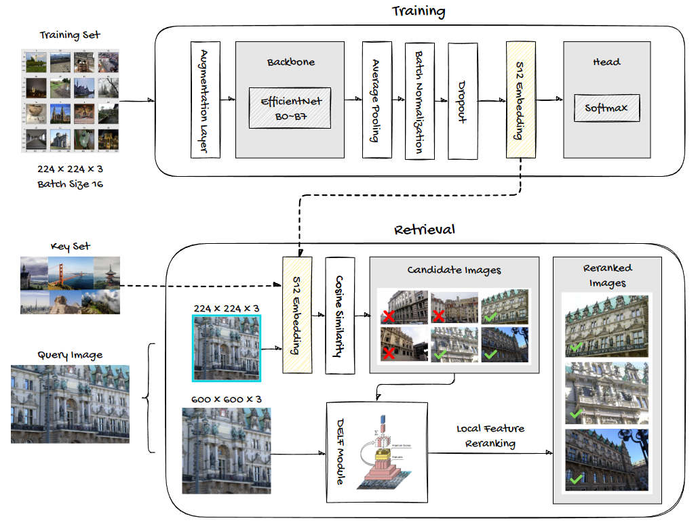

[![Contributors][contributors-shield]][contributors-url]

  <h1 align="center">Google Landmark Recognition Challenge 2020</h1>

<!-- ABOUT THE CHALLENGE -->
## About The Challenge

[Google Landmark Recognition 2020](https://www.kaggle.com/competitions/landmark-recognition-2020/) was the third instance of the competition sponsored by Google and hosted on Kaggle. It challenged Kagglers to build models that recognize the correct landmark (if any) on a public and a private test set of real pictures taken by Google operators.

### GLDv2

The training data for the competition comes from a cleaned version of the original [Google Landmarks Dataset v2 (GLDv2)](https://github.com/cvdfoundation/google-landmark), which consists of over 5M images and over 200k distinct instance labels (landmarks).

### Challenges

The biggest challenges in this competition and to the landmark recognition task are captured by the GLDv2 dataset, containing:
1. Extremely skewed class distribution. While famous landmarks might have tens of thousands of image samples, 57% of classes have at most 10 images and 38% of classes have at most 5 images.
2. Intra-class variability. Landmarks have views from different vantage points, and of different details, as well as both indoor and outdoor views of buildings.
3. Out-of-domain query images. The query set consists of only 1.1% images of landmarks and 98.9% out-of-domain images, for which no result should be expected.

More details about the dataset construction, its cleaned version, and other particular challenges related to the Landmark Recognition task are available in the [dataset paper](https://arxiv.org/abs/2004.01804).

## Medium Article
I dedicated a [Medium Article](https://medium.com/mlearning-ai/metric-learning-for-landmark-image-recognition-6c1b8e0902bd) where I explain, illustrate, and implement the ideas behind a baseline architecture for landmark image recognition. There, I cover its core concepts from theory to practical results.

## About this Repository

This repository contains my implementation of a metric learning solution with cosine similarity search (using an EfficientNet backbone for image embedding), paired with a DELF module for reranking based on local features of the images. These techniques were adapted from the [2020 Recognition challenge winner](https://arxiv.org/abs/2010.01650) and [2019 Recognition challenge 2nd place](https://arxiv.org/abs/1906.03990) papers. The notebooks contained here illustrate the implementation on a subset of the competition data.

### My Kaggle Notebook

The notebooks in this repository were split from my original [Kaggle notebook](https://www.kaggle.com/code/erichhenrique/gldv2-2020/notebook) to enable rendering on Github. Please consider leaving an upvote on my notebook if you find the content helpful for your applications!

(<a href="#top">back to top</a>)

<!-- MARKDOWN LINKS & IMAGES -->
<!-- https://www.markdownguide.org/basic-syntax/#reference-style-links -->
[contributors-shield]: https://img.shields.io/github/contributors/erich-hs/Elderly-Wellbeing.svg?style=for-the-badge
[contributors-url]: https://github.com/erich-hs/Elderly-Wellbeing/graphs/contributors
